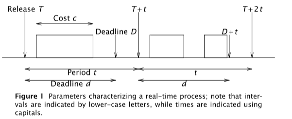
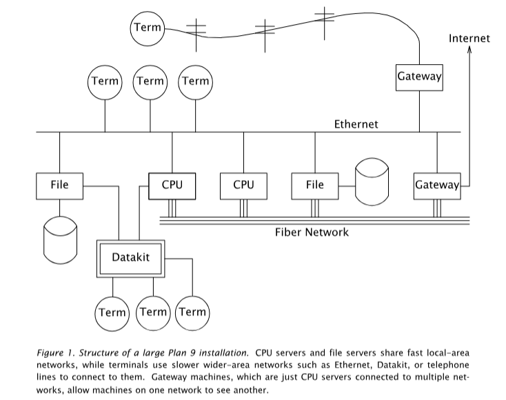

[comment]: # (THEME = black)
[comment]: # (CODE_THEME = base16/zenburn)
# Nov 7 OSIS notes

james ryan, ant nosaryev, evan rosenfeld

fall 2025

[comment]: # (|||)

## In progress:
* Setting up remote debug on Ox64
* Thinking about roadmap

[comment]: # (|||)

## Remote debug?

We set up OpenOCD to use a JTAG programmer on the board -- this lets us see
things like live register state while the board is active

We did not finish the setup, there is no clear documentation.

[comment]: # (|||)

## Side tangent

Indexing all of the resources is becoming unwieldly

[Zotero](https://www.zotero.org/support/adding_items_to_zotero)

[comment]: # (|||)

## Papers: Real Time os?

[Real time in Plan 9](https://2e.iwp9.org/Real-time.pdf)

Real time operating systems have a scheduler which requires some kind of
*deadline* If a process can run within that deadline, it gets scheduled.

[comment]: # (|||)

[comment]: # (|||)

## Papers: Plan 9?

[Plan 9 Paper](https://css.csail.mit.edu/6.824/2014/papers/plan9.pdf)

Created by Bell Labs, resources are network accessible and distributed. Its an
interesting objective for an OS, especially embedded ones, to create a
centralized network of microcontrollers?

Inspired by comments about LoRa, but feasibility...?

[comment]: # (|||)

[comment]: # (|||)
