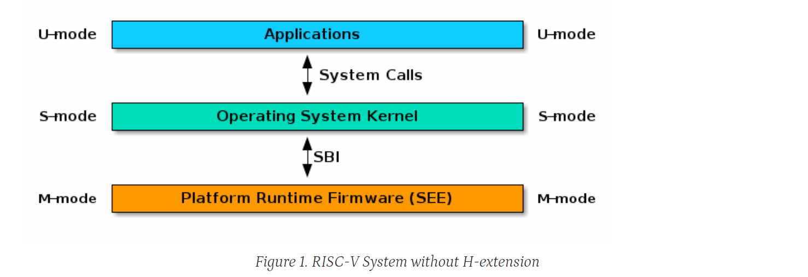

[comment]: # (THEME = black)
[comment]: # (CODE_THEME = base16/zenburn)
# Oct 9 OSIS notes

jaems ryan, ant nosaryev, evan rosenfeld
fall 2025

[comment]: # (|||)

## RISC-V (*risk-five*) crash course

[comment]: # (|||)
## instruction types

[comment]: # (|||)
## priveledge modes

This is important since some instructions require a hart to be in a specific
mode before it can be executed. some control and state registers are protected
and cannot be modified in user mode, for example

There are 3 modes: User, Supervisor, and Machine

[comment]: # (|||)

SEE - supervisor execution environment, "The SEE can be a simple boot loader 
and BIOS-style IO system in a low-end hardware platform" priveledged manual s1.1

[comment]: # (|||)
From sect 1.2 of the priveleged manual:

> Code run in machine-mode (M-mode) is usually inherently trusted, as it has low-
> level access to the machine implementation. M-mode can be used to manage secure execution
> environments on RISC-V...

[comment]: # (|||)
> A hart normally runs application code in U-mode until some trap (e.g., a supervisor call or a timer
> interrupt) forces a switch to a trap handler, which usually runs in a more privileged mode. The hart will
> then execute the trap handler, which will eventually resume execution at or after the original trapped
> instruction in U-mode... 

[comment]: # (|||)
> Traps that increase privilege level are termed vertical traps, while traps that
> remain at the same privilege level are termed horizontal traps. The RISC-V privileged architecture
> provides flexible routing of traps to different privilege layers.

[comment]: # (|||)
Question: how do we implement this SEE & SBI to enable us to run system calls
and do things from userspace?

[comment]: # (|||)

¯\\\_(ツ)\_/¯

[comment]: # (|||)
## model kernel

[https://github.com/mit-pdos/xv6-riscv](https://github.com/mit-pdos/xv6-riscv)

Used by other univertities to demonstrate OS design

[comment]: # (|||)
## online emulator

well documented and runs in a browser

[https://github.com/d0iasm/rvemu](https://github.com/d0iasm/rvemu)

[comment]: # (!!!)
# roadmap

[comment]: # (|||)
## our focus?

We arent looking at any accelerator or coprocessor features. we are concerned
with running code directly on a risc v core, and potentially utilizing one or
more hart (thread). we may use accelerators or coprocessors for some things (I/O
applications)

[comment]: # (|||)
# next 2 weeks?

1. Read the [supervisor binary interface](https://github.com/riscv-non-isa/riscv-sbi-doc/releases/tag/v3.0)

2. Read Chapter 3 in RISC V ISA, Volume II

3. Make a repo github or git.ee.cooper.edu

4. ON an emulator (QEMU), then on the board, practice getting past the
   bootloader and debugging (eg, set a value in a register, and using a debug
   tool read the register value) 

