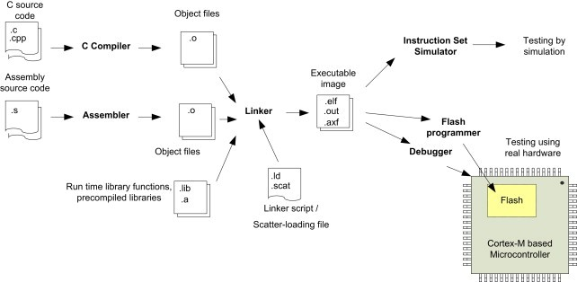

[comment]: # (THEME = black)
[comment]: # (CODE_THEME = base16/zenburn)
# Oct 24 OSIS notes

james ryan, ant nosaryev, evan rosenfeld

fall 2025

[comment]: # (|||)

## Supervisor Binary Interface

Ox64 SDK includes [OpenSBI](https://github.com/riscv-software-src/opensbi) project.

This gives us an interface to do common tasks (print debug characters, reboot,
set timers)

[comment]: # (|||)

## How do we actually boot? 

We wanted to -- *slight* detour into arm

[comment]: # (|||)

### Bare metal programming guide

Thanks to Fred Kim for showing us this

[Bare Metal Programming Guide](https://github.com/cpq/bare-metal-programming-guide/tree/main)

[comment]: # (|||)

`This guide is written for developers who wish to start programming microcontrollers using a GCC compiler and a datasheet, without using any framework`

[comment]: # (|||)

## The boot process

Conceptually, the SBI is the first "program" to run when we start our board. It
initializes the hardware, and then moves the program counter to a specified
location, handing control to the next process.

[comment]: # (|||)

We need to use a linker script to lay out the rest of our operating system in
memory. This includes defining where the entry point goes, and what regions of
memory we have access to. 

[comment]: # (|||)

[comment]: # (|||)

[Example "kernel" and linker script](https://github.com/cpq/bare-metal-programming-guide/tree/main/steps/step-0-minimal)

This is for an ARM Cortex-M4.

[comment]: # (|||)

[Here's the entry linker script for our board](https://github.com/openbouffalo/OBLFR/blob/92bde04ef7487e4b4d333ae5a54b018a085fc0aa/bsp/common/bl808/bl808_flash_d0.ld)

[comment]: # (|||)

[Our current repo](https://github.com/secureshellprotocol/ece491)

We will likely, moving forward, adopt the SDK instead of handling the linker
ourselves. We have only attempted booting in a VM.

[comment]: # (|||)

# Qemu demo?

[comment]: # (|||)

## Todo

make documentation for all of this, including setting up the dev tools, and
setting up a board
